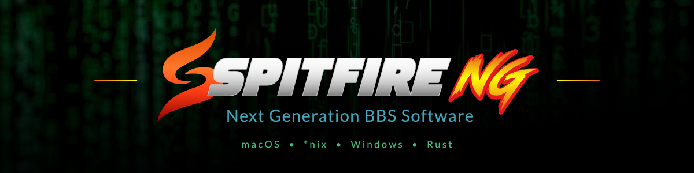

<p align="center">
  
</p>

# SPITFIRE NG

SPITFIRE NG is a modern, cross-platform reimplementation of the SPITFIRE
Bulletin Board System. It preserves the caller experience and operating model
that made SPITFIRE recognizable while replacing DOS-era constraints with safe,
maintainable Rust code.

The project is independently implemented. It is not an original Buffalo Creek
Software executable, an official historical release, or SPITFIRE 3.7 itself.

## What is SPITFIRE NG?

SPITFIRE NG is both a usable BBS and a preservation project. Its guiding rule
is simple:

> If a behavior is part of SPITFIRE's identity, preserve it. If it is merely a
> DOS or hardware limitation, modernize it.

That means familiar security levels, command-driven menus, conferences, file
areas, caller statistics, Sysop interaction, and editable displays—backed by
modern authentication, SQLite storage, portable paths, reliable terminal
input, multinode isolation, and tested backup and restore.

## Current status

SPITFIRE NG 0.1.0 is a publicly available **Development Preview**. Source,
operator documentation, and the accepted Apple Silicon macOS binary are
published in this repository.

The latest downloadable binary remains 0.1.0. The `main` branch now contains
post-0.1.0 source improvements, including advanced caller/text message
discovery, auditable message mutation, an auditable caller-access lifecycle,
schema-13 caller identity separation, and secure SSH caller transport; those
improvements are not present in the published 0.1.0 archive.

Available today:

- accepted Stock SPITFIRE 3.7 Core Parity;
- accepted ANSI/text caller and operator experience parity;
- Modern, Classic SPITFIRE-inspired, and Minimal Terminal presentation
  profiles;
- engine-generated stock menus and exact-security display overrides;
- Telnet, RAW TCP, and RLogin compatibility listeners plus—when built from
  current source—a disabled-by-default SSH-2 caller listener through the same
  session engine, with no host OS shell route;
- caller registration, Argon2id authentication, profiles, and security plus—
  when built from current source—disable/restore, recoverable deletion,
  base/effective security, subscription expiry/warnings/renewal, JOKER name
  denial, named-Sysop protection, active-session invalidation, and separate
  normalized login identifier/public handle/optional private real name;
- messages, conferences, private mail, replies, queues, receipts, and—when
  built from current source—bounded Specific Caller/Text Search, primary plus
  CC delivery, authorized Delete/Undelete, audience transitions, and
  source-retaining Copy/Forward;
- file areas, uploads, downloads, new-file checks, and supported transfer
  protocols;
- multinode operation, operator status, cold backup, and restore, including
  schema-13 identity, caller-access state, SSH configuration, and SSH host-key
  continuity when built from current source;
- an en-US localization baseline and versioned language-pack interface; and
- a verified Moebius 1.0.29 workflow for authoring `.CLR` screens on macOS.

The current prebuilt target is Apple Silicon macOS
(`aarch64-apple-darwin`). It is unsigned and unnotarized. See
[Status](STATUS.md) for the exact release boundary and current limitations.

## Development Preview

The published release is:

```text
spitfire-ng-0.1.0-development-preview-aarch64-apple-darwin.tar.gz
SHA-256: 6c4d7ad492b1acee92481a3a577b49934c08e79822e98de50e918489a8fc9c97
```

Download the archive, checksum, manifest, and release notes together from the
[official `v0.1.0-development-preview` GitHub Release](https://github.com/cdaters/spitfire-ng/releases/tag/v0.1.0-development-preview).
The published archive was downloaded again, matched the SHA-256 above, and
returned `SPITFIRE NG Bulletin Board System 0.1.0` on Apple Silicon macOS.
Synchronizing newer source does not change that accepted archive, tag, or
checksum.

## Installation

The Development Preview package contains a prebuilt `spitfire` executable,
operator documentation, release metadata, licenses, and dependency notices.
Git and Cargo are not required for normal operation.

Start with:

1. [Development Preview Package](docs/operator/development-preview-package.md)
2. [macOS First Run](docs/operator/macos-first-run.md)
3. [Getting Started](docs/operator/getting-started.md)

Developers can build from source with:

```sh
cargo build --release --locked -p sf-bbs
./target/release/spitfire --version
```

## Quick start

After verifying and extracting the package:

```sh
./bin/spitfire setup /path/to/your-board
./bin/spitfire status /path/to/your-board
./bin/spitfire run /path/to/your-board
```

Setup creates a self-contained board with configuration, data directories,
presentation profiles, and the en-US language package. The operator guide
explains listener configuration, first calls, messages, files, and backups.

## Documentation

- [Documentation index](docs/README.md)
- [Operator guide](docs/operator/README.md)
- [Configuration](docs/operator/configuration.md)
- [Architecture](docs/04-system-architecture.md)
- [Compatibility principles](docs/02-compatibility-principles.md)
- [Presentation profiles](docs/presentation-profiles.md)
- [Localization](docs/localization.md)
- [Caller access lifecycle and security](docs/sfng-caller-access.md)
- [Secure SSH caller transport](docs/sfng-secure-ssh-transport.md)
- [Roadmap](ROADMAP.md)

## Custom ANSI screens

Sysops can customize a board without editing managed profile packages. Put
board-owned overrides in the board's `display/` directory; they take
precedence over active-profile resources, with generated menus as the final
fallback.

The [Customizing Display Screens](docs/operator/custom-display-screens.md)
guide includes exact-security filenames and the verified Moebius 1.0.29 macOS
workflow: IBM VGA/CP437, 16-color ANSI, iCE colors off, static ANSI, **Save
Without Sauce Info**, and no UTF-8 export.

## Compatibility and original SPITFIRE

SPITFIRE NG uses original documentation and legally held local artifacts as
read-only evidence. Proprietary binaries, registered copies, DISPLAY files,
and other historical assets are not distributed in this repository.

For original software, manuals, and preservation downloads, visit
[Original SPITFIRE Software & Documentation](https://spitfirebbs.com/).
The [historical overview](docs/HISTORICAL-SPITFIRE.md) and
[parity checklist](docs/stock-spitfire-3.7-parity.md) explain how historical
behavior maps to the modern implementation.

## What is not included yet?

The Development Preview does not include RIP graphics, caller-selectable
presentation profiles, production non-English translations, the remaining
advanced Category-B command set, QWK/LAKOTA, SMB/DOVE-Net, FidoNet/CircuitNet,
web administration, SFDraw, SFDATE, or SFREG. The 0.1.0 downloadable binary
also predates the SSH and schema-13 source additions.

Traditional Telnet, RAW, and RLogin transports are plaintext compatibility
features. Use them only on networks where that risk is understood.

## Contributing

Contributions are welcome from BBS developers, Sysops, preservationists, and
retro-computing enthusiasts. Read [CONTRIBUTING.md](CONTRIBUTING.md) before
submitting code, format research, documentation, or presentation resources.

Historical compatibility claims need evidence. Never commit proprietary
software, private caller data, registered binaries, or unlicensed artwork.

## Support and security

Use the public issue tracker for reproducible, sanitized bugs. Include the
SPITFIRE NG version, platform, terminal client, transport, terminal size and
encoding, active profile, and reproduction steps. See
[Support and Bug Reports](docs/operator/support.md).

Security vulnerabilities should be reported privately according to
[SECURITY.md](SECURITY.md). Never post passwords, caller databases, secrets,
private messages, or registered historical binaries.

## License and provenance

Original SPITFIRE NG source code and project-authored distributable resources
are available under **MIT OR Apache-2.0**, at your option. See
[LICENSE-MIT](LICENSE-MIT) and [LICENSE-APACHE](LICENSE-APACHE).

That license does not relicense original Buffalo Creek Software material,
third-party research archives, external source code, or community packages.
Each independently distributed presentation or language package retains its
own license and provenance metadata. See
[Licensing and Provenance](docs/licensing-and-provenance.md) for the complete
boundary.
