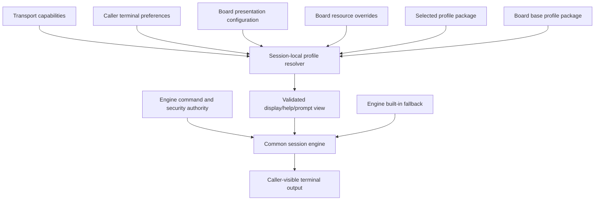

# SPITFIRE NG Presentation Profiles

## Status and purpose

This is the canonical design and validation contract for versioned
presentation profiles. The 0.1.0 binary packages Modern 1.0.1, Minimal
Terminal 1.0.1, and Classic SPITFIRE-inspired 1.1.1. Current post-0.1.0 source
advances those packages to Modern 1.1.0, Minimal 1.1.0, and Classic 1.2.0 for
the independently authored Specific Caller/Text Search menu/help surfaces.
Their project-authored metadata is licensed under `MIT OR Apache-2.0`; no
profile imports historical assets. Profile format/resource API 1 are unchanged.

A presentation profile is a bounded, declarative package of caller-visible
resources and metadata. It changes how an already-authorized SPITFIRE NG
operation is presented, never what the operation means or who may perform it.

```text
SPITFIRE NG engine + presentation profile + resources = caller experience
```

The engine remains authoritative for authentication, callers, security,
sessions, nodes, messages, files, transfers, paging semantics, and persistent
state. A profile cannot add code or become a storage/backend plug-in.

## Design invariants

Every implementation of this specification must preserve these rules:

1. Profiles are above the transport-neutral session engine. Telnet, RAW,
   RLogin, stdio, serial/modem, and future transports do not implement their
   own profile rules.
2. Profiles contain data only. They cannot contain executable scripts, native
   libraries, template code, database migrations, or external commands.
3. Board configuration and domain services remain authoritative. A profile
   cannot change authentication, security, menu authorization, message/file
   access, transfers, statistics, node allocation, or backup semantics.
4. Historical bytes remain byte-preserving CP437/ANSI inputs. Profile loading
   does not silently convert or reflow them.
5. Missing, malformed, unsupported, or incompatible presentation data degrades
   deterministically to usable content. A decorative failure cannot strand a
   caller or grant an action.
6. Profile selection and resolution are session-local immutable state. One
   caller or node cannot change another caller's presentation.
7. Existing unprofiled boards keep their resources until a Sysop explicitly
   adopts the future profile system. Implementation must not mistake generated
   setup files for unmodified defaults and overwrite them.

These invariants extend Decisions D-001, D-002, D-004, D-017, D-021, and the
existing resource fallback contract in
[Legacy Data and File Formats](06-legacy-file-formats.md).

## Architectural boundary



The resolver produces an immutable view for one session. It may select bytes,
wording, layout, colors, artwork, and safe display macros. It does not produce
an authorization result or dispatch target.

## Package and storage boundary

Version 1 installs profiles at one deterministic board-local search location
inside the existing logical `SYSTEM` tree:

```text
SYSTEM/
└── presentation-profiles/
    └── <profile-id>/
        ├── profile.toml
        ├── resources/
        │   ├── display/
        │   └── help/
        ├── README.md
        └── LICENSES/
```

The exact directory spelling is an implementation detail, but the following
properties are contractual:

- the source is board-local, relative, confined, and contains regular files;
- symlinks, traversal, special files, duplicate case-folded names, excessive
  file counts, and oversized resources are rejected;
- all caller-visible resources are declared and independently hashed;
- profile packages are captured by the existing recursive `SYSTEM` backup;
- the selected/base profile IDs and versions belong in versioned static TOML,
  not SQLite; and
- restore reproduces the exact descriptor and bytes, then validates them
  before the board admits callers.

A later installer or catalog may copy a package into this board-local store.
Version 1 does not depend on a global host profile directory, network fetch,
or external package service. That keeps cold backup/restore self-contained.
Discovery validates the configured active ID/package first and the configured
base second when it is distinct; an identical active/base ID is loaded once.
This validation order affects only ordered diagnostics. Resource resolution
always remains board override → active → distinct base → built-in and never
depends on directory enumeration order.

## Versioned metadata model

The serialized form is strict TOML. Unknown fields fail closed for descriptor
format 1, which uses the following top-level model:

| Field | Contract |
|---|---|
| `format_version` | Positive integer defining descriptor syntax; the current value is 1. |
| `id` | Stable 1–64-byte lowercase ASCII slug made of nonempty alphanumeric segments separated by `-`; data, not an engine enum. |
| `version` | Core `MAJOR.MINOR.PATCH` semantic profile release version. Pre-release/build syntax is reserved for a later descriptor version. |
| `display_name` | Human-readable name shown to the Sysop. |
| `description` | Bounded plain-language purpose and intended audience. |
| `resource_api_version` | Presentation resource API version required from the engine; the current value is 1. |
| `engine` | Strict table containing inclusive `minimum` and exclusive `maximum_exclusive` core-SemVer engine versions; never used to migrate databases. |
| `compatibility_target` | Evidence-labeled target such as current NG, SPITFIRE 3.7-inspired, or text-minimal. |
| `supported_formats` | Declared `bbs`, `clr`, and/or fixed-record `spitfire-help` representations; unsupported values are rejected. |
| `fallback_policy` | Version-1 value `base-then-built-in`. |
| `provenance` | One or more provenance/license records described below. |
| `resources` | Exact logical key, kind, format, relative path, SHA-256, and provenance reference for each asset. |

`modern-ng` is the packaged default, `minimal-terminal` is the text-first
alternative, and `classic-spitfire` is the historical-inspired alternative.
All three IDs remain data rather than engine variants.
Board configuration identifies both an active profile and one base profile.
The base role, not a literal ID, is the engine concept.

Each resource record has:

- a stable semantic key, such as display stem `WELCOME1`, exact-security menu
  art `MAIN:10`, action help identifier, or prompt key;
- a resource kind: display, menu artwork, help content, or prompt content;
- a supported representation and encoding expectation;
- a confined package-relative path;
- exact byte length and SHA-256; and
- a provenance-record ID.

Unlisted files may contain only descriptor documentation or licenses and are
never rendered. Duplicate semantic-key/format pairs are invalid. This prevents
filesystem enumeration order from changing the caller experience.

Minimal format-1 example (hash abbreviated here only; real descriptors require
64 hexadecimal characters):

```toml
format_version = 1
id = "modern-ng"
version = "1.0.0"
display_name = "Modern SPITFIRE NG"
description = "The unchanged default SPITFIRE NG presentation."
resource_api_version = 1
compatibility_target = "SPITFIRE NG Development Preview"
supported_formats = ["bbs", "clr", "spitfire-help"]
fallback_policy = "base-then-built-in"

[engine]
minimum = "0.1.0"
maximum_exclusive = "0.2.0"

[[provenance]]
id = "spitfire-ng"
kind = "project-authored"
creator = "Craig Daters and SPITFIRE NG contributors"
rightsholder = "Craig Daters and SPITFIRE NG contributors"
source = "SPITFIRE NG source-tree generated starter resources"
license = "MIT OR Apache-2.0"
redistribution = "allowed"

[[resources]]
key = "WELCOME1"
kind = "display"
format = "bbs"
path = "resources/display/WELCOME1.BBS"
bytes = 75
sha256 = "<64 lowercase hexadecimal characters>"
provenance = "spitfire-ng"
```

## Provenance and licensing model

Every caller-visible asset or explicitly declared asset group must reference
one provenance record. The record contains:

| Field | Meaning |
|---|---|
| `kind` | `historical-original`, `historical-inspired`, `project-authored`, `third-party`, or `generated` |
| `creator` | Known creator/organization, or `unknown` without invention |
| `rightsholder` | Known rights holder, kept distinct from creator |
| `source` | Human-readable source/citation and optional exact source hash |
| `license` | SPDX expression when applicable, otherwise a documented `LicenseRef-*` value |
| `redistribution` | `allowed`, `local-only`, or `unknown` |
| `modifications` | None, or an honest summary and date of derivative changes |
| `evidence` | Repository document or protected local record supporting the classification |

The categories mean:

- **historical-original:** exact or directly derived original SPITFIRE-era
  bytes. They are not presumed redistributable or project-owned.
- **historical-inspired:** newly authored work informed by historical behavior
  or style without copying the original bytes.
- **project-authored:** original SPITFIRE NG work with project-controlled
  licensing.
- **third-party:** separately authored assets used under an identified license.
- **generated:** deterministic output whose generator, inputs, and resulting
  license/provenance are recorded.

A production profile distributed by this repository may contain only assets
whose redistribution is explicitly `allowed`. `local-only` profiles let a
Sysop use lawfully possessed assets without converting that possession into a
redistribution claim. `unknown` licensing fails the distributable-profile gate.
Backups containing local-only assets remain sensitive private board backups.

Current project-authored packages use the SPDX expression
`MIT OR Apache-2.0` and record redistribution as `allowed`. That license covers
only original SPITFIRE NG code and project-authored distributable resources.
It does not relicense preserved Buffalo Creek materials, registered/private
binaries, research archives, Synchronet material, or other third-party work.
Each package retains its own license/provenance records; a future compatible
third-party package may declare different terms.

Classic therefore uses newly authored, rights-cleared historical-inspired
assets. Any later third-party addition would require a separately reviewed
license grant. Preserved DISPLAY samples remain read-only evidence and are not
a production asset pack.

## Selection ownership

### Board selection

The Sysop selects one active profile and one base profile in static board
configuration. The active choice defines the board's presented identity. The
base profile supplies compatible fallback when the active package lacks a
resource. The current Modern presentation should be the initial base/default;
Classic must never become the default merely because it is installed.

Profile changes are cold configuration in version 1. `spitfire config` section
7 selects `profile` or `legacy-resources` mode and the active/base IDs. Static
configuration validates the mode and confined IDs; package descriptors and
assets validate when runtime/status loads, before listener startup. The board
runtime then shares one immutable resolver while each session independently
selects CLR/BBS from its effective terminal/caller capabilities. Live reload
is outside version 1.

### Caller selection

Version 1 does not add caller-selectable profiles or a database field. Existing
caller preferences continue to control graphics/text, width, page length,
MORE, scrolling, and hot keys. A future preference should live in the existing
caller profile/preferences experience, select only from a Sysop-approved set,
and fall safely to board policy when removed, disabled, incompatible, terminal-
inappropriate, or disallowed. Board profile policy, caller preference, locale,
terminal capability/encoding, menu mode, and board override ownership remain
separate concepts.

### Terminal capability

Terminal negotiation never chooses the active profile. It selects the safest
compatible representation inside each resource layer. Effective ANSI requires
all of:

- the terminal reports ANSI capability;
- the caller permits ANSI/color presentation; and
- the selected resource layer declares a usable CLR representation.

A text-only terminal selects BBS content. Unsupported RIP never receives raw
RIP bytes. Future RIP support must add an explicit capability and preserve the
historical RIP→CLR→BBS intent without changing this ownership model.

### Transport

There is no transport-specific profile override in version 1. Transports
supply bounded capabilities only. This prevents Telnet, RAW, RLogin, serial,
or future SSH from silently presenting different commands or fallback policy.

## Board-local display authoring

The display-authoring audit fixes the operator-facing byte contract without changing profile format
or resolution. A board-owned `.BBS` is non-ANSI ASCII/CP437; `.CLR` is a
16-color ANSI stream with ASCII/CP437 glyphs. Newly authored files use CRLF and
omit UTF-8 BOM, NUL, SAUCE, and terminal DOS EOF because the current renderer
does not transcode or strip them. Clear/home is chosen deliberately per
resource, not imposed on every menu.

Moebius 1.0.29 is verified for CLR on macOS with CP437/16-color, 80×25,
iCE off, static art, Save Without Sauce, and no UTF-8 export. The untouched
reference export passed exact-byte inspection and NG/Qodem/SyncTERM runtime acceptance.
Direct BBS export and RIP remain unclaimed. Operators copy managed art into
`<board>/display/`, inspect it, and test on a rehearsal board; see
[Customizing Display Screens](operator/custom-display-screens.md).

## Deterministic resource precedence

Resolution is layer-first, then representation-first within each layer:

1. board resource override;
2. selected active profile package;
3. configured base profile package, unless it is the selected profile;
4. engine built-in fallback.

Exact-security Main/Message/File/Sysop menu displays have a narrower
leaf contract: board override → active profile exact match → engine-generated
menu. A base profile does not contribute exact menu artwork. This guarantees
that an intentionally absent exact resource remains a selectable generated
experience.

For an ANSI-capable caller, each filesystem layer tries usable CLR, then usable
BBS. For a text caller, each layer tries usable BBS only. Therefore a Classic
profile with a missing or malformed CLR uses its own BBS before trying a Modern
CLR/BBS resource, preserving profile coherence and the requested safe fallback:

```text
Classic CLR → Classic BBS → base-profile CLR/BBS → built-in text
```

Board overrides are intentionally stronger than packaged defaults so a Sysop
can customize the board without editing an installed package. An override is
also format-specific: an ANSI caller may use a valid board CLR, while a text
caller independently resolves the board BBS or falls to the next layer.

The lookup uses normalized semantic keys, never arbitrary caller-supplied
paths. Case-fold collisions are rejected during validation. Resolution results
are deterministic across hosts and independent of directory enumeration order.

## Failure and fallback contract

| Condition | Required behavior |
|---|---|
| Resource absent | Continue to the next representation/layer. |
| Resource oversized, unreadable, hash-mismatched, or malformed | Reject it, record a privacy-safe diagnostic, and continue. |
| Representation unsupported by the terminal/engine | Do not emit its bytes; continue to a compatible representation. |
| Active descriptor missing or incompatible | Mark presentation degraded and use the configured base profile. |
| Base descriptor missing or incompatible | Use bounded built-in presentation; expose degraded status to the Sysop. |
| Exact-security menu artwork missing/inconsistent | Generate the menu from authoritative authorized menu entries. |
| Help content missing | Show bounded contextual help/unavailable text and return to the same menu. |
| Optional decorative resource missing | Continue the owning operation without a blank input trap. |
| Terminal write/disconnect failure after output begins | End the affected session normally; do not replay another layer after partial output. |

Fallback must never hide invalid authoritative configuration. The existing
required Main/Message/File `.MNU` files remain startup requirements; a profile
cannot replace that failure with attractive artwork. Every fallback returns to
a defined session context and consumes no stale command input.

## Menu, command, help, prompt, and macro authority

### Menus and commands

The board's validated `.MNU` definitions and engine action registry remain
authoritative for:

- command letter;
- immutable historical command identifier;
- minimum security and visibility;
- implemented/unavailable dispatch; and
- the destination/return context.

A profile may provide wording, layout, colors, and exact-security menu artwork.
It may not ship an authoritative `.MNU`, lower security, create a command,
remap an identifier, or make unsupported Category-B behavior appear present.

The historically evidenced generated-menu path is an explicit board choice.
`presentation.menu_mode = "generated"` always renders Main, Message,
File, and Sysop from parsed, security-filtered `.MNU` records. The default
`display-overrides` mode uses this exact-menu chain:

1. usable board exact-security BBS/CLR resource;
2. usable active-profile exact-security BBS/CLR resource; then
3. the engine-generated menu.

Exact menu art is deliberately not inherited from a base profile. Non-menu
resources retain board -> active -> base -> built-in fallback. The caller's
exact security level selects the suffix; it is not replaced by the configured
Sysop threshold. The caller-context implementation adds the same bounded
engine-owned board-local/caller/session footer to
generated and exact-art Main/Sysop presentation; it does not add command or
state authority to a profile.

A future machine-readable menu-presentation record should key labels by the
immutable action identifier. Static menu artwork must declare the identifiers
and command letters it advertises. If that declaration disagrees with the
caller's authorized menu set, the resolver rejects the artwork and the engine
renders its security-filtered generated menu. This companion declaration is a
safety contract; the engine does not attempt to infer authorization by parsing
ANSI art.

### Help

Profiles may change help wording and layout, but help lookup remains keyed to
the engine's immutable action identifier. A historical `SPITFIRE.HLP` adapter
may supply the content only after its fixed record map validates. Help text
cannot make an unavailable command executable or move the caller to another
context.

### Prompts

Prompts use stable semantic keys and bounded byte strings. A profile may label
existing choices but cannot add input grammar or change the meaning of a key.
For example, MORE remains S=Stop, N=Nonstop, Enter=continue regardless of
profile wording. Required prompts always have built-in text.

### Display macros

Profiles use the existing allowlisted display controls/macros. Unknown legacy
macros remain visible rather than guessed. Expansion never exposes credentials,
other callers' private fields, transport authentication, host paths, or hidden
administrative metadata. Profiles cannot define executable or recursive
macros in version 1.

## Profile definitions

### Modern SPITFIRE NG

Normal setup from current source selects `modern-ng` version 1.1.0 as both
active and base. Its strict package contains the current project-authored
`.BBS`/`.CLR` bytes and generated fixed-record `SPITFIRE.HLP`; the four board
`.MNU` files remain outside the package as engine-authoritative configuration.
Required prompt text remains the engine built-in layer. The profile targets a
new Sysop/caller using contemporary BBS clients: readable 80-column output,
modest ANSI color, accurate SPITFIRE NG identity, explicit unavailable
boundaries, and complete text fallback.

Existing configuration that omits `[presentation]` deserializes to explicit
`legacy-resources` mode and continues direct SYSTEM/DISPLAY lookup. It is not
silently migrated or overwritten. Board overrides continue to use logical
DISPLAY and therefore survive the new packaging boundary unchanged.

### Classic SPITFIRE-inspired

The canonical [Classic profile specification](classic-presentation-profile.md)
records its evidence and rights boundary. The package
includes:

- newly authored BBS and CLR resources following the evidenced startup/login/
  section/Goodbye sequence;
- 80×25 composition, CP437 box-drawing expectations, restrained ANSI color,
  stock terminology, display controls, and exact-security menu variants;
- labels only for commands actually authorized and implemented by the engine;
- provenance records and a rights-cleared distribution decision for every
  byte; and
- deterministic Classic text → Modern compatible → built-in fallback.

The stable ID is `classic-spitfire`, display name is `Classic
SPITFIRE-Inspired`, current source package version is 1.2.0, and Modern remains
its configured base. The package targets the existing 25 general resource keys,
seven exact-security menu-art keys, and fixed-record help interface. It must
use independently authored BBS/CLR/help content with complete allowed
provenance; the original 27-entry DISPLAY archive, four `.MNU` files, original
HLP wording, RIP material, and screenshots remain evidence rather than
distributable assets.

Stock automatic post-login message summaries and new-file prompting remain
engine-owned historical behavior. An independent board policy,
`caller.post_login_journey = "stock"`, that invokes one fixed allowlisted
sequence using live authorized state. It defaults to `none`; profile data
cannot select, reorder, or extend it. Profile format/API 1 is unchanged.

Future research remains necessary for RIP behavior/assets, the complete
advanced display inventory, unknown display controls, exact presentation of
unimplemented stock-advanced features, and any permission to redistribute
original Buffalo Creek assets. An operator-supplied local-only profile is a
separate compatibility path, not the distributed Classic profile.

### Minimal Terminal

`minimal-terminal` version 1.1.0 in current source targets
plain or constrained terminals, accessibility, automation-friendly diagnostics,
and low-capability clients. Normal setup installs the package beside Modern but
continues to select Modern by default. A Sysop explicitly selects Minimal as
active and normally retains Modern as the base.

The strict format-1 descriptor declares only `bbs` and `spitfire-help`. Its 33
hashed resources comprise 25 general displays, seven exact-security menu-art
files, and one fixed-record help file. All are deterministic project-authored
content with redistribution `allowed`. The displays are ASCII, contain no ESC,
CLR, `@CLS@`, color, cursor-positioning, or CP437 dependency, and keep each
authored line at 48 bytes or fewer. Main, Message, and File menus are
single-column with visible command identifiers and fit an 80×25 terminal.

The package deliberately does not own prompts or `.MNU` command definitions.
Resource API 1 keeps required prompts in the engine fallback layer; the four
board `.MNU` files continue to define identifiers and security. Exact-security
menu art is supplied for ordinary security 10 and Sysop security 50; other
levels use the existing generated authorized menu. Help wording is Minimal-
specific but retains the same engine action identifiers.

Minimal uses the existing output-unit pager, negotiated rows/columns, caller
page-length preference, S/N/Enter behavior, information-panel acknowledgment,
and binary-transfer isolation. It is a complete presentation, not an error
mode, and is not selected automatically for RAW. An ANSI-capable caller on a
valid Minimal package still receives the same BBS bytes as a text-only caller.
If a Minimal asset is invalid, normal active → Modern base → built-in fallback
applies; an ANSI caller may therefore see compatible Modern CLR only in the
degraded fallback path.

Limitations are intentional: there is no responsive reflow engine, no profile-
authored prompt API in format 1, no CLR/ANSI art, and no historical/Classic
content. Very small terminals scroll or page through the same line-oriented
units rather than invoking a terminal emulator.

## Acceptance contract

A profile may be labeled **Implemented** when the resolver can load and use it.
It may be labeled **Verified** only when the evidence below is recorded for the
exact profile ID, profile version, descriptor digest, SPITFIRE NG commit, and
terminal/client versions. **Planned** profiles have no runtime claim.

### 1. Descriptor and package validation

- accept a valid version-1 descriptor and exact inventory;
- reject unknown versions/fields, invalid IDs/versions, duplicate keys,
  unsupported formats, path escape, symlinks, special files, case collisions,
  hash/length disagreement, and unbounded input;
- validate every provenance reference and licensing/redistribution value; and
- prove distributable profiles contain no `local-only` or `unknown` assets.

### 2. Resolution and failure matrix

For BBS and CLR resources, test board override → active → base → built-in with
missing, malformed, unsupported, incompatible, and exact-security cases.
Prove Classic CLR failure chooses Classic BBS before Modern fallback. Prove
directory order and filename case do not change the result.

### 3. Caller journey

Exercise each supported profile through:

1. startup/prelogin;
2. new and returning login;
3. Main;
4. Messages, including read/post/Your Messages;
5. Files, including list and one safe transfer;
6. contextual Help;
7. Comment/Page/Sysop interaction as authorized;
8. Goodbye/logoff; and
9. reconnect with saved terminal preferences.

Every cancel, empty, unavailable, security-rejected, and missing-resource path
must return to a defined context without stale input.

### 4. Terminal/client matrix

| Profile | ANSI acceptance | Text acceptance | Real clients |
|---|---|---|---|
| Modern | Required | Required | SyncTERM and Qodem; RAW for text/fallback |
| Classic | Required before Verified | Required before Verified | SyncTERM and Qodem; RAW where applicable |
| Minimal | Not required for content; ANSI clients must remain usable | Required | SyncTERM and Qodem in text settings; RAW |

RLogin, stdio, serial, and modem retain automated shared-engine regression.
Physical hardware or a specific client is not claimed unless it was actually
run and recorded.

### 5. Non-presentation regression

For every profile and mixed-capability multinode run, prove:

- identical authentication, security, privacy, and command authorization;
- no exposure of private messages, profile PII, credentials, or host paths;
- unchanged message/file state and statistics;
- X/Y/ZMODEM/Telink binary ownership with no presentation-byte interference;
- paging, abort, cancel, and hot-key input isolation;
- session-local profile/capability state with no cross-node leakage;
- cold backup/restore preservation of configuration, descriptor, provenance,
  profile assets, overrides, database, resources, and cataloged bytes; and
- clean stop/restart and deterministic profile resolution after restore.

### 6. Evidence record

Acceptance must record PASS, FAIL, or NOT APPLICABLE for every journey and
client/profile cell, exact fallback cases exercised, unresolved visual or
historical differences, quality-gate results, and hashes/versions sufficient
to reproduce the result. A screenshot is supporting presentation evidence,
not proof of authorization or privacy.


## Language-package relationship

Presentation profile selection and locale selection are orthogonal. The
active/base resolver selects authored BBS/CLR/HLP bytes and never rewrites or
translates them. Engine prompts, generated-menu titles and semantic action
labels, live context, paging, and interactive message/file text resolve from
the board-local language package selected by `language.default_locale`.
Consequently `classic-spitfire + en-US` and `modern-ng + en-US` share one
behavioral catalog without multiplying profile IDs. Locale data cannot change
`.MNU` letters, identifiers, security, dispatch, or profile fallback. See the
[Localization Contract](localization.md).


## Related specifications

- [M034 Classic Profile Specification](classic-presentation-profile.md)
- [Legacy Data and File Formats](06-legacy-file-formats.md)
- [System Architecture](04-system-architecture.md)
- [Caller/Sysop Interaction and Terminal Fidelity](sfng-caller-sysop-interaction.md)
- [Setup and Configuration](sfng-setup-configuration.md)
- [Native Backup and Restore](sfng-backup-restore.md)
- [Classic Fidelity and Provenance Review](research/m036-classic-fidelity-review.md)
- [Localization Contract](localization.md)
